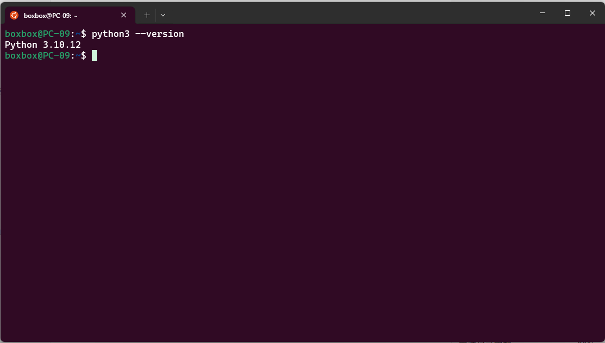

# AI机器人课程 - 第1周作业
## 基本信息
- 姓名: 白夏
- 学号: 20231913
- 日期: 2026-03-04
## 环境信息
- 操作系统: Windows 11 + WSL2 / macOS / Ubuntu 22.04
- ROS2版本: Humble
- Python版本: 3.10/3.11
## 安装系统
- [x] Python3 + VSCode
- [x] ROS2 (WSL2/Docker/双系统)
- [x] OpenCLAW (可选)
## 运行结果
- Python: `python --version` 截图

- ROS2: Turtlesim 截图

- OpenCLAW: OpenCLAW 截图  
