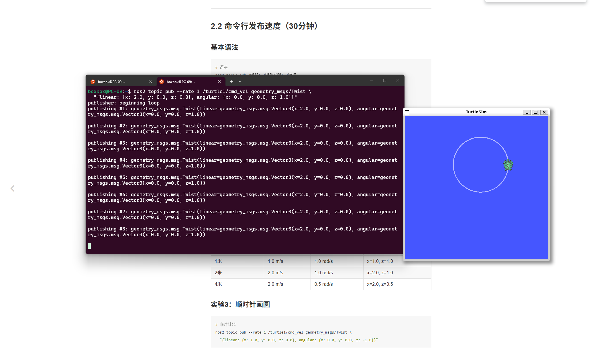
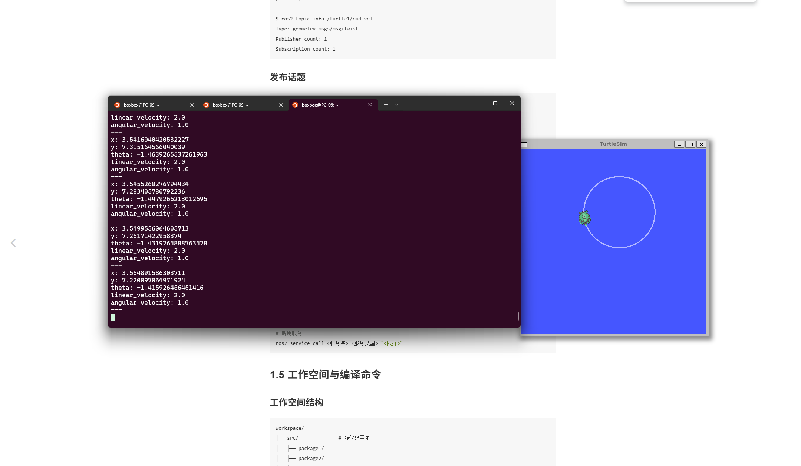

# AI机器人课程 - 第3周作业
## 节点命令（Node Commands）
### 查看节点  
- 列出所有运行中的节点  
ros2 node list
- 查看节点信息  
ros2 node info /节点名称
### 运行节点
- 运行一个包中的节点  
ros2 run <包名> <节点名>
- 示例：运行小乌龟  
ros2 run turtlesim turtlesim_node
ros2 run turtlesim turtle_teleop_key
## 话题命令（Topic Commands）
### 发布话题
- 发布消息到话题  
ros2 topic pub <话题名> <消息类型> "<数据>"
- 示例：让小乌龟直线前进  
ros2 topic pub /turtle1/cmd_vel geometry_msgs/msg/Twist "{linear: {x: 1.0, y: 0.0, z: 0.0}, angular: {x: 0.0, y: 0.0, z: 0.0}}"
### 监听话题
- 监听话题消息  
ros2 topic echo <话题名>
- 示例：监听小乌龟位置  
ros2 topic echo /turtle1/pose

## 实验：基础画圆
- 让小乌龟画圆（前进 + 左转）  
ros2 topic pub --rate 1 /turtle1/cmd_vel geometry_msgs/Twist \
  "{linear: {x: 2.0, y: 0.0, z: 0.0}, angular: {x: 0.0, y: 0.0, z: 1.0}}"
## 运行截图

