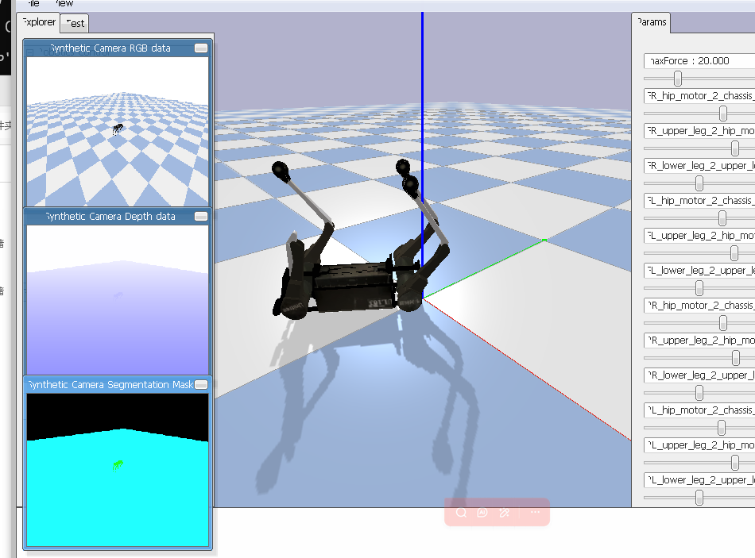

# AI机器人课程 - 第4周作业
## 小乌龟正方形移动
#### 走正方形 = 4条直线 + 4次90°转弯

         ┌───────────┐
         │           │
    ③    │    ②      │    ①
         │           │
         │           │
         │    ④      │
         └───────────┘
              ↑
           起点/终点

- 步骤分解：
- 1. 直行 → 右转90°
- 2. 直行 → 右转90°  
- 3. 直行 → 右转90°
- 4. 直行 → 右转90°（回到起点）

## PyBullet仿真
- PyBullet = Python + Bullet物理引擎,一个开源的3D物理仿真库，支持机器人、车辆、物体等.   
│Turtlesim│PyBullet│  
├───────────┼──────────┤  
│──2D平面仿真│3D空间仿真────│  
│─简单的小乌龟│真实的机器人模型│  
│──入门学习──│──进阶学习────│  
│只有一只小乌龟│可以有多个机器人│
## 安装PyBullet
-  安装PyBullet
pip install pybullet
- 或使用conda
conda install pybullet -c conda-forge  
### 运行Panda机械臂：
python -m pybullet_robots.panda.loadpanda  
- 效果：运行命令后会弹出一个3D窗口，显示Panda机械臂模型，可以交互控制
- 主要功能：  
🎯 7自由度机械臂  
🖐️ 夹爪末端执行器  
🎮 支持位置/速度/力控制  
📐 逆运动学求解  
## 运行截图
- 小乌龟走正方形

- 机器狗
