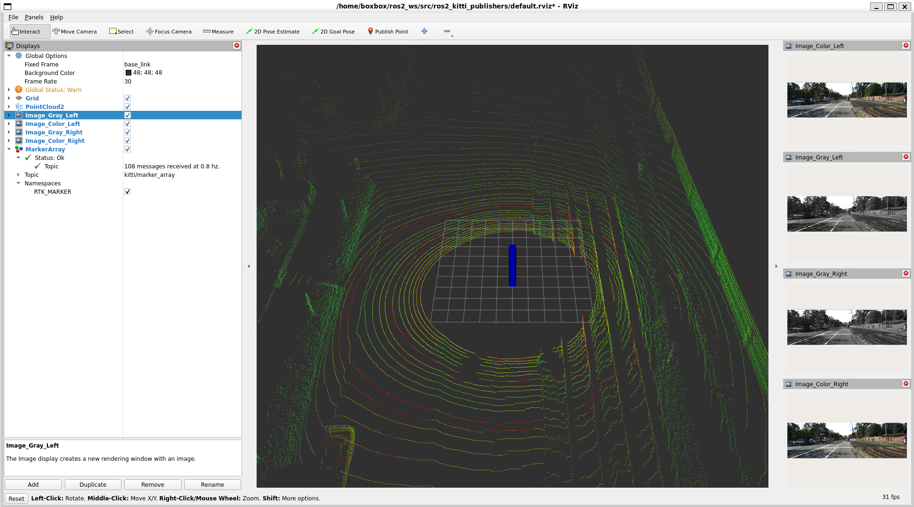
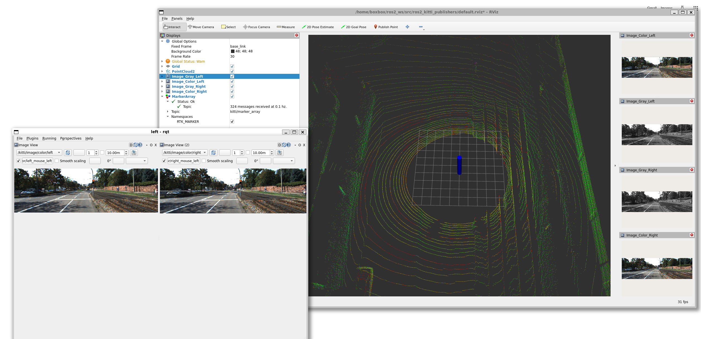

# AI机器人课程 - 第6周作业
## 常用传感器介绍  
### 机器人传感器分类：
#### 外部传感器(感知环境)
- 激光雷达、超声波、红外  
- 相机、触觉、深度相机
#### 内部传感器(感知自身)
- 里程计、编码器、电流
- IMU、陀螺仪、磁力计

### 传感器 -> 类型 -> 功能 -> 典型应用
激光雷达 -> 外部 -> 测距、避障 -> 扫地机器人、无人车  
相机 -> 外部 -> 成像、识别 -> 视觉导航、目标检测  
深度相机 -> 外部 -> 3D成像 -> 室内导航、抓取  
超声波 -> 外部 -> 测距 -> 避障、定高  
里程计 -> 内部 -> 测位移 -> 定位、导航  
IMU -> 内部 -> 测姿态 -> 稳定控制、航向  

## 激光雷达(LiDAR)
LiDAR = Light Detection and Ranging，通过发射激光并接收反射光来测量距离
##### 查看激光雷达话题
ros2 topic list | grep scan
##### 监听激光数据
ros2 topic echo /scan  
输出示例：  
angle_min: 0.0  
angle_max: 6.283  
angle_increment: 0.0174  
ranges: [1.2, 1.3, 1.1, 0.9, ...]  # 360个点  

## RViz可视化工具
RViz = ROS Visualization，ROS的三维可视化工具，可以显示机器人模型、传感器数据、地图等  
##### 启动RViz
rviz2
##### 或者指定配置文件
rviz2 -d my_config.rviz

## 运行截图

