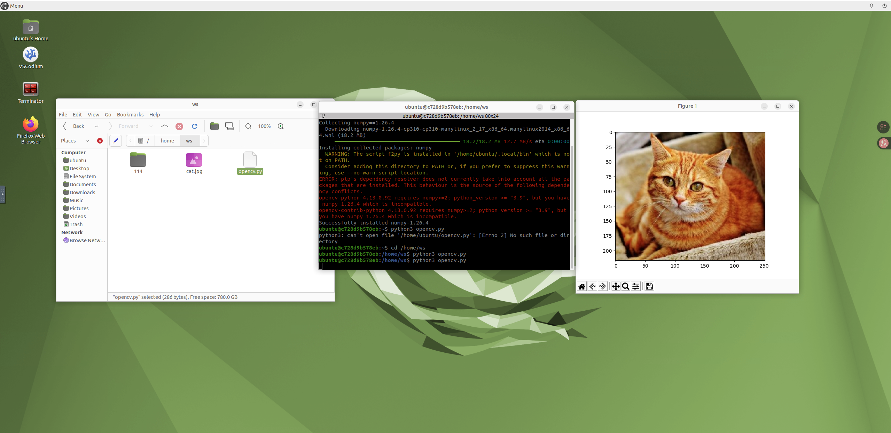
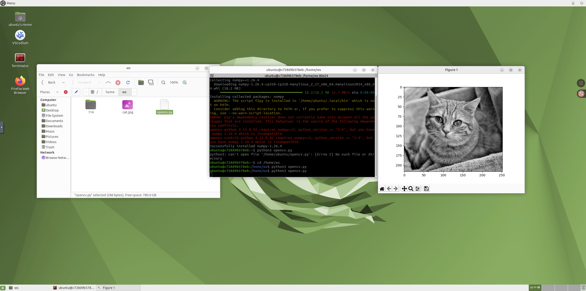
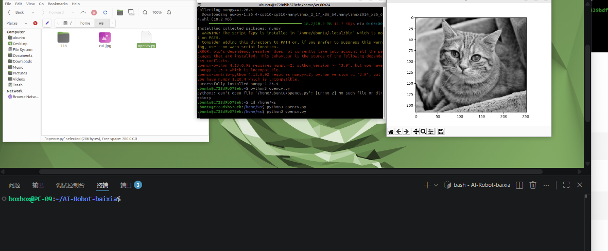

# Week 10：Docker 概念与 OpenCV 实验

本周继续学习 Docker，并开始使用 OpenCV 进行图像处理实验。课程目标是理解图像在程序中如何读取、显示、转换和保存，为后续 ArUco 标记识别和机器人视觉测距做准备。

## 实验内容

- 在 Docker 或本地 Python 环境中安装 OpenCV。
- 使用 `cv2.imread()` 读取图片。
- 将彩色图像转换为灰度图。
- 使用 `cv2.imshow()` 或保存文件观察处理结果。
- 对比原图、灰度图和处理后的图像效果。

## 代码说明

`opencv.py` 是本周主要代码文件，读取 `cat.jpg` 并进行基础图像处理。核心代码如下：

```python
import cv2

img_basic = cv2.imread("cat.jpg", cv2.IMREAD_COLOR)
img_gray = cv2.cvtColor(img_basic, cv2.COLOR_BGR2GRAY)
cv2.imwrite("gray_output.jpg", img_gray)
```

运行方式：

```bash
python3 opencv.py
```

如果在无图形界面的环境中运行，建议把显示窗口相关代码改为保存图片文件，再通过文件查看结果。

## 运行截图







## 演示视频

本周演示视频记录了截图对应的环境、命令或实验效果，便于在 GitHub Pages 中和截图一起检查作业完成情况。

[点击查看本周演示视频](demo.mp4)

## 课程内容摘要

本周把 Docker 概念与 OpenCV 图像处理结合起来。Docker 负责提供稳定环境，OpenCV 负责完成图像读取、颜色空间转换、保存和显示。机器人视觉任务往往从最基础的图像输入开始，再逐步进入目标检测、标记识别、测距和导航。本周作业中的 `opencv.py` 虽然简短，但包含了完整处理链路：读取原图、转换灰度图、输出结果并截图记录。这样的流程为 Week12 的手机摄像头和 ArUco 实验做了直接铺垫。

## 学习总结

OpenCV 是机器人视觉任务中非常重要的工具。本周实验虽然只是读取和转换图片，但它展示了图像处理程序的基本结构：输入图像、处理图像、输出结果。后续 ArUco 识别、摄像头接入和自动导航都需要类似的处理流程。Docker 则保证这些图像处理依赖可以在稳定环境中运行。


