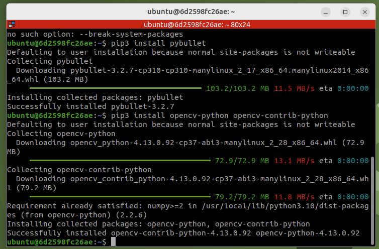
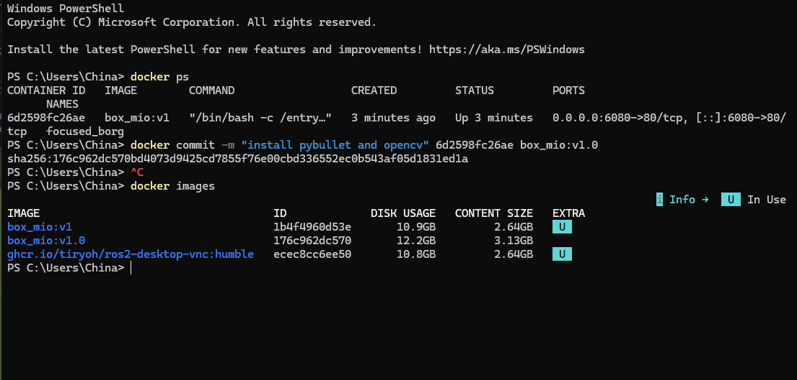
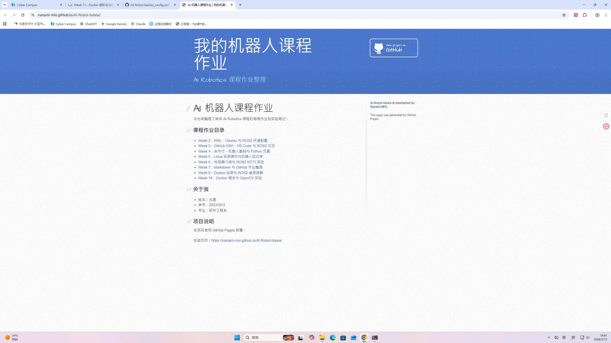

# Week 11：Docker 进阶与 GitHub Pages 网页部署

本周学习 Docker 进阶操作和 GitHub Pages 部署。前几周的实验主要关注本地运行，本周开始把课程作业整理成可以在线访问的网页。这样不仅方便展示每周成果，也能让项目说明、截图和代码形成一个完整的学习档案。

## 实验内容

- 查看正在运行的 Docker 容器。
- 停止、重启和保存容器状态。
- 理解 Docker 镜像和容器的区别。
- 整理 GitHub 仓库根目录和各周作业目录。
- 开启 GitHub Pages，让 README 页面可以在线浏览。

## 常用 Docker 命令

```bash
docker ps
docker ps -a
docker stop <container_id>
docker start <container_id>
docker commit <container_id> my-ros2-full:v1.0
docker images
```

## GitHub Pages 部署步骤

1. 打开 GitHub 仓库页面。
2. 进入 Settings。
3. 找到 Pages 设置。
4. Source 选择 Deploy from a branch。
5. Branch 选择 `main`，Folder 选择 `/root`。
6. 保存后等待页面构建完成。

部署完成后，可以通过类似下面的地址访问：

```text
https://nanami-mio.github.io/AI-Robot-baixia/
```

## 代码说明

`week11_pages_check.py` 记录了 GitHub Pages 页面整理时需要检查的项目，例如根目录 README、每周 README、图片路径和 Pages 分支设置。

运行方式：

```bash
python3 week11_pages_check.py
```

## 运行截图








## 学习总结

本周最大的收获是理解了项目展示和代码运行同样重要。Docker 解决的是环境一致性问题，GitHub Pages 解决的是成果展示问题。一个机器人项目如果只有代码但没有说明，别人很难复现；如果只有截图但没有代码，也无法证明实现过程。把 README、图片和脚本整理好，能够让整个学习过程更清楚。


