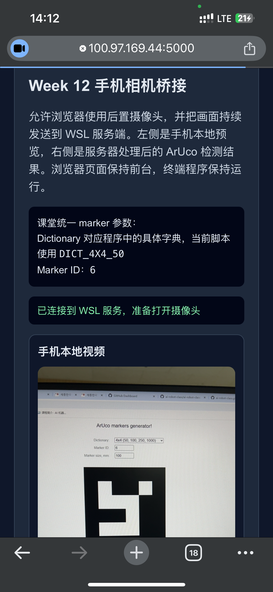
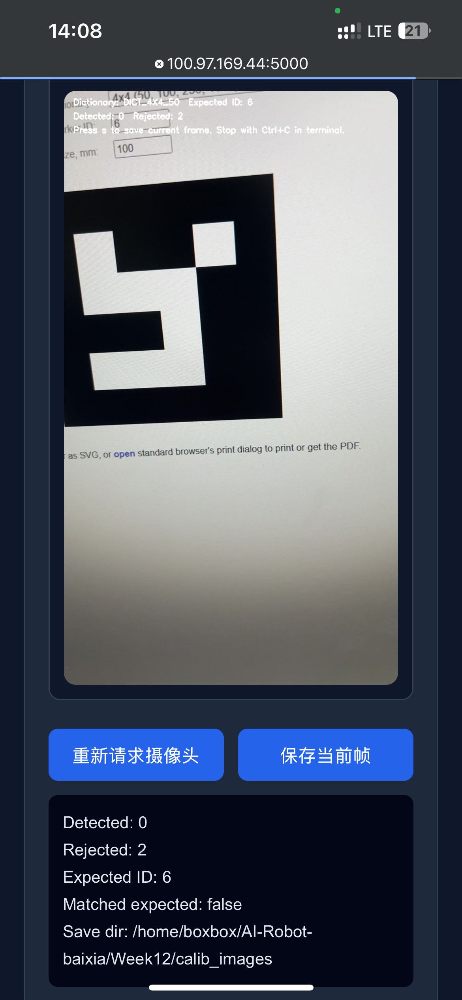

# Week 12：手机摄像头、ArUco 识别与距离测量

本周任务是把手机摄像头画面接入电脑端程序，并使用 OpenCV 识别 ArUco 标记，进一步估计目标距离。实验重点是理解“手机作为传感器”的工程链路：手机采集图像，通过局域网或 Tailscale 发送到电脑，电脑端 Flask 服务接收图像并进行视觉处理。

## 完成内容

- 编写并整理 `camera_bridge.py`，提供网页端摄像头上传和服务端预览功能。
- 使用 OpenCV 处理上传图像，为 ArUco 标记检测和距离估计做准备。
- 保存运行截图 `img12-1.jpg` 与 `img12-2.jpg`，展示手机摄像头接入和网页预览效果。
- 记录依赖文件 `requirements.txt`，便于在新环境中安装 Flask、OpenCV 等库。

## 运行方式

安装依赖：

```bash
pip install -r requirements.txt
```

启动桥接程序：

```bash
python3 camera_bridge.py
```

然后在手机和电脑处于同一网络或同一 Tailscale 网络时，使用手机浏览器访问服务器地址。网页会调用手机摄像头并把画面上传到服务端，服务端可以显示预览、保存图片并继续做 ArUco 识别。

## 运行截图





## 代码说明

`camera_bridge.py` 的核心职责包括：

- 提供浏览器页面，让手机端可以打开摄像头。
- 接收前端上传的图像帧。
- 使用 OpenCV 解码图像。
- 提供 `/preview.jpg` 接口显示服务端最新画面。
- 保存关键帧，便于调试 ArUco 标记识别效果。


## 课程内容摘要

本周内容连接手机摄像头、ArUco 标记识别与距离测量。手机摄像头提供实时图像流，OpenCV/ArUco 负责在图像中找到标记角点，再结合标记实际尺寸和相机参数估算距离。这个过程让我理解视觉测量不是只看图片，而是需要成像模型、尺度标定和稳定的数据流。README 中记录运行方式、依赖、截图和代码说明，是为了说明实验链路从摄像头输入到识别输出都可以被复现和检查。

## 学习总结

本周实验把手机、网络、网页和 Python 图像处理连接成了一条完整链路。相比单纯运行本地 OpenCV 脚本，手机摄像头接入更接近真实机器人系统：传感器不一定和计算程序在同一台设备上，网络延迟、图像尺寸、上传频率和识别稳定性都会影响最终效果。这个实验也为 Week 14 的手机遥控和局域网通信项目打下了基础。


