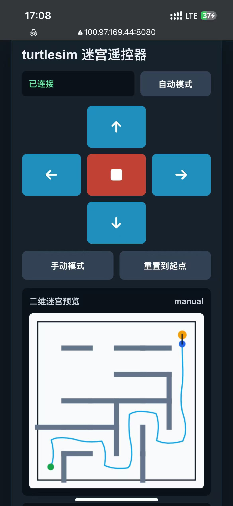

# Week 14：手机遥控 + 局域网通信 + 仿真机器人迷宫探索

本周选择课程项目方向 B：使用 ROS2 turtlesim 作为二维机器人仿真对象，通过手机网页发送控制命令，让小乌龟在迷宫中完成手动遥控和自动探索。项目遵守课程要求的“单一常驻程序”原则：网页只负责发送命令，`turtlesim_web_bridge.py` 同时负责 WebSocket 通信、ROS2 速度发布、迷宫碰撞检测、终点判定和自动探索调度。

## 项目目标

- 手机网页可以控制乌龟前进、后退、左转、右转和停止。
- 电脑端桥接程序通过 WebSocket 接收网页命令，并发布 `/turtle1/cmd_vel`。
- 迷宫边界和障碍物具有碰撞检测，乌龟撞墙时不会继续前进。
- 接入 `explorer.py`，在自动模式下使用 A* 路径规划走向终点。
- 网页端显示二维迷宫、乌龟位置、轨迹、当前模式和碰撞状态。

## 文件结构

```text
Week14/
├── README.md
├── img14-1.jpg
├── turtlesim_auto.mp4
├── week14_turtlesim_single_report_concise_updated.pdf
└── turtlesim_remote/
    ├── turtlesim_web_bridge.py
    ├── explorer.py
    ├── maze.py
    ├── index.html
    └── requirements.txt
```

## 运行方式

第一个终端启动 turtlesim：

```bash
source /opt/ros/humble/setup.bash
ros2 run turtlesim turtlesim_node
```

第二个终端启动网页桥接程序：

```bash
source /opt/ros/humble/setup.bash
cd Week14/turtlesim_remote
pip install -r requirements.txt
python3 turtlesim_web_bridge.py
```

浏览器或手机打开：

```text
http://localhost:8080
```

如果使用手机控制，需要手机和电脑进入同一个 Tailscale 网络，再访问电脑的 Tailscale IP 地址加端口 `8080`。

## 自动探索实现

`maze.py` 生成 6x6 复杂迷宫，并提供障碍物、边界、起点、终点和格点邻接关系。`explorer.py` 使用 A* 算法在格点图上规划从当前位置到终点的路径，再把路径点转换为连续运动控制。`turtlesim_web_bridge.py` 在自动模式下周期性调用：

```python
linear, angular = self.explorer.decide(self.get_state())
```

得到速度命令后仍然经过原有的 `compute_safe_motion()` 安全检查，因此自动模式和手动模式共享同一套碰撞检测与终点判定逻辑。

## 界面与成果



[点击查看本周演示视频](turtlesim_auto.mp4)

项目还包含演示视频 `turtlesim_auto.mp4` 和报告 `week14_turtlesim_single_report_concise_updated.pdf`。网页 `index.html` 支持手动/自动切换，自动运行时会在迷宫预览中绘制行走轨迹，方便展示探索过程。

## 验证记录

已完成以下静态检查：

```bash
python -m py_compile turtlesim_remote/maze.py turtlesim_remote/explorer.py turtlesim_remote/turtlesim_web_bridge.py
python turtlesim_remote/maze.py
python turtlesim_remote/explorer.py
```

迷宫自检结果显示 BFS 可达，A* 规划器能够生成到终点的路径。

## 学习总结

这个项目把前面几周的内容串在一起：Week 7 的网页与仓库整理、Week 10 的 Python/OpenCV 工程习惯、Week 12 的手机与局域网通信，以及 ROS2 的话题控制。最大的收获是理解了“控制链路必须集中”的工程原则。自动探索不是另开一个程序抢控制，而是作为常驻桥接程序内部的一个模式运行，这样状态、碰撞、终点和网页显示都保持一致。

