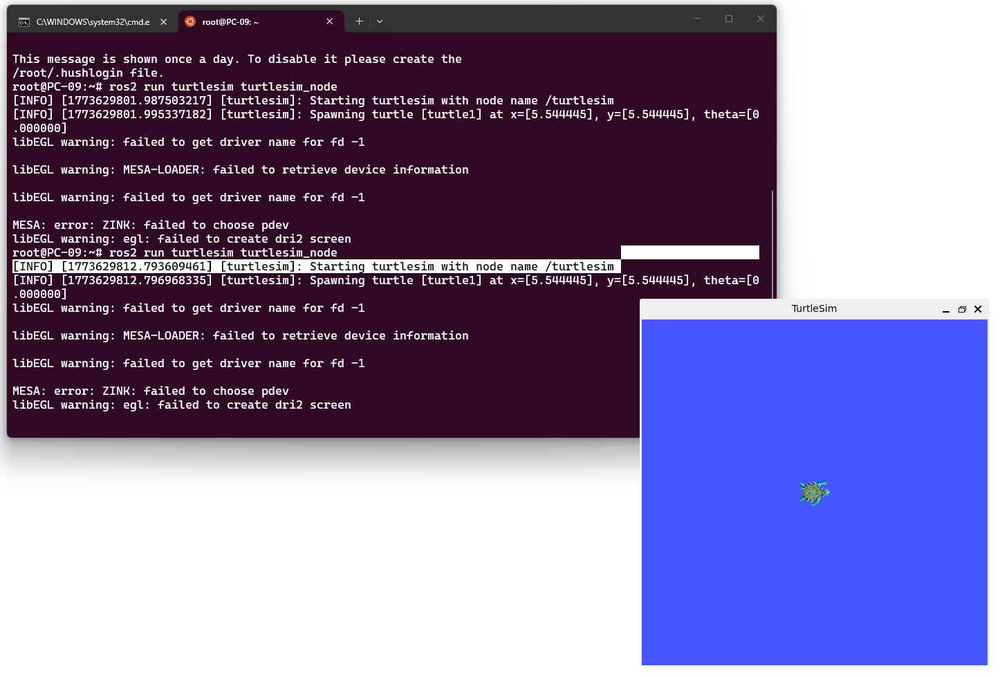
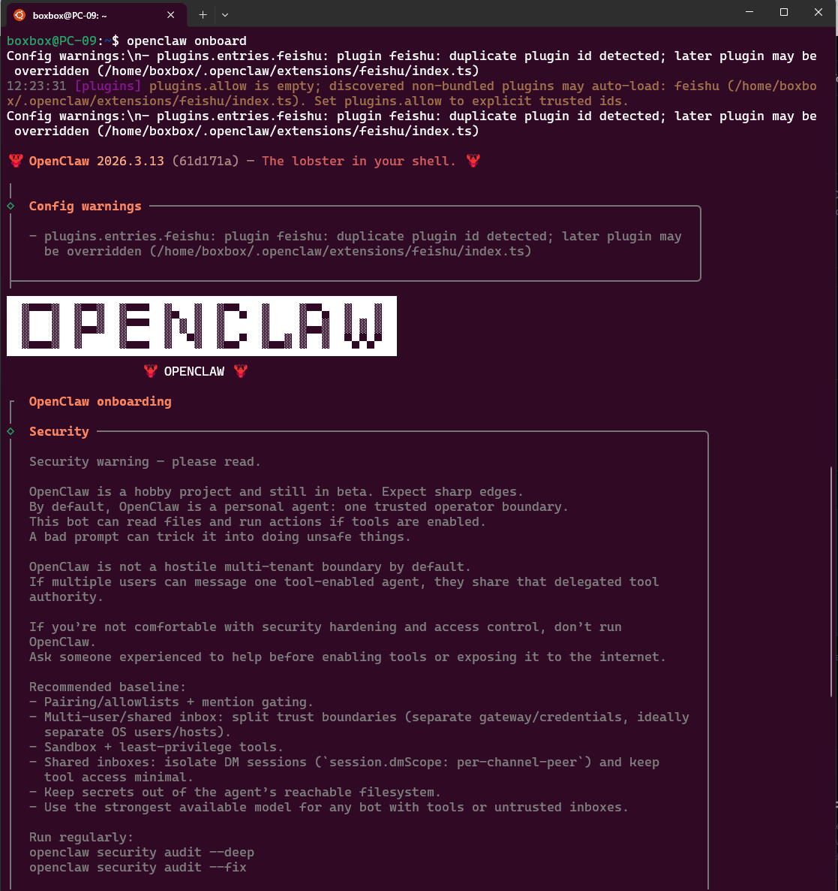

# Week 2：WSL、Ubuntu 与 ROS2 环境配置

本周主要完成 AI 机器人课程的基础开发环境搭建。机器人课程后续会频繁使用 Linux 命令行、Python、ROS2 和 turtlesim，因此 Week 2 的重点是让电脑具备可运行 ROS2 实验的基础条件，并确认常用工具可以正常启动。

## 实验内容

1. 在 Windows 中启用 WSL，并安装 Ubuntu 22.04。
2. 熟悉 Ubuntu 终端的基本操作，例如 `pwd`、`ls`、`cd`、`mkdir` 和 `python3 --version`。
3. 安装或检查 ROS2 Humble 环境。
4. 运行 turtlesim，确认图形界面和 ROS2 命令可以正常使用。
5. 整理环境截图和检查脚本，为后续课程实验做准备。

## 关键命令

```bash
wsl --install
lsb_release -a
python3 --version
source /opt/ros/humble/setup.bash
ros2 run turtlesim turtlesim_node
```

为了避免每次打开终端都手动 source ROS2，可以把下面这行加入 `~/.bashrc`：

```bash
source /opt/ros/humble/setup.bash
```

## 代码说明

本周补充了 `week2_environment_check.py`，用于检查系统平台、Python 版本以及 `ros2`、`turtlesim_node` 等命令是否能在当前环境中找到。

运行方式：

```bash
python3 week2_environment_check.py
```

## 运行截图






## 演示视频

本周演示视频记录了截图对应的环境、命令或实验效果，便于在 GitHub Pages 中和截图一起检查作业完成情况。

[点击查看本周演示视频](demo.mp4)

## 课程内容摘要

本周课程对应环境配置入门，核心不是单纯安装软件，而是建立后续机器人实验的统一工作台。WSL 让 Windows 用户可以使用接近真实 Linux 服务器的命令行环境，Ubuntu 22.04 与 ROS2 Humble 的组合也方便后续运行 turtlesim、Python 节点和图形化仿真。整理作业时，我把重点放在三个可复现证据上：系统版本、Python 与 ROS2 命令、turtlesim 启动截图。这样即使换电脑或重新安装，也能按 README 中的步骤快速定位问题。

## 学习总结

Week 2 的任务虽然还没有写复杂代码，但它决定了后续实验能不能顺利进行。我学会了在 WSL 中使用 Ubuntu，理解了 Windows 和 Linux 子系统之间的关系，也第一次运行了 ROS2 的 turtlesim 示例。通过这个过程，我认识到机器人开发通常依赖一套稳定的系统环境，环境配置本身就是工程能力的一部分。


