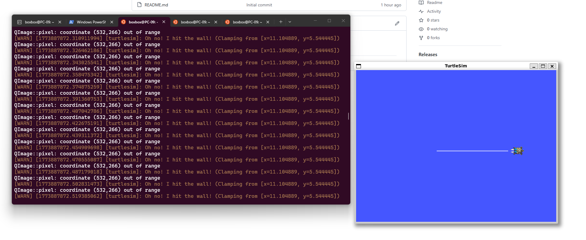
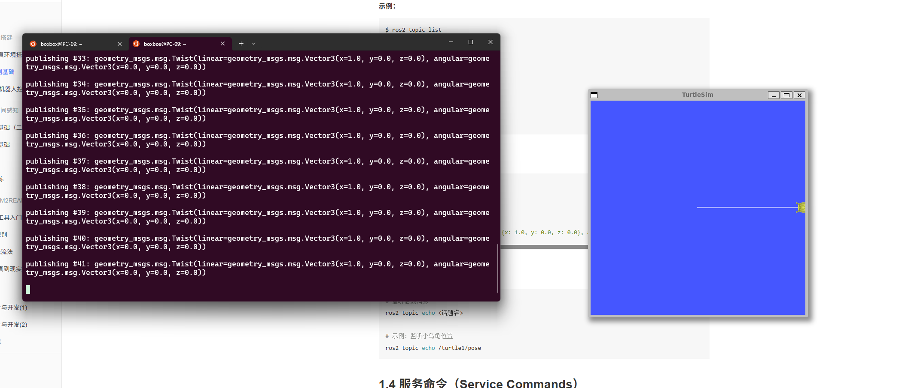
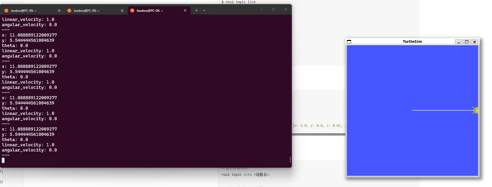

# Week 3：GitHub SSH、VS Code 与 ROS2 命令行交互

本周在 Week 2 的环境基础上继续练习开发工具链。主要内容包括 GitHub SSH 配置、VS Code 连接 WSL、Git 基本提交流程，以及 ROS2 命令行对 turtlesim 的控制和观察。目标是让代码编辑、版本管理和 ROS2 调试形成一个顺畅的工作流程。

## 实验内容

- 配置 GitHub SSH key，确认本地仓库可以通过 SSH 推送到 GitHub。
- 使用 VS Code 打开 WSL 中的课程作业目录。
- 学习 `git status`、`git add`、`git commit`、`git push` 的基本用法。
- 启动 turtlesim，并通过 ROS2 命令查看节点、话题和位姿数据。
- 记录乌龟移动效果和命令行输出截图。

## 常用命令

```bash
ssh-keygen -t ed25519 -C "your_email@example.com"
cat ~/.ssh/id_ed25519.pub
git status
git add .
git commit -m "update week3 homework"
git push
```

ROS2 相关命令：

```bash
source /opt/ros/humble/setup.bash
ros2 run turtlesim turtlesim_node
ros2 topic list
ros2 topic echo /turtle1/pose
```

## 代码说明

`week3_git_ros_notes.py` 记录了本周最常用的一组 Git 与 ROS2 命令。运行它可以快速回顾本周练习内容：

```bash
python3 week3_git_ros_notes.py
```

## 运行截图







## 课程内容摘要

本周从“能运行环境”推进到“能管理代码和远程协作”。SSH 密钥解决的是本机与 GitHub 之间的可信连接，VS Code 解决的是在 WSL 中编辑、运行和提交代码的效率问题，ROS2 命令行练习则帮助我理解节点、话题、消息之间的关系。作业整理时，我把命令记录、截图和检查脚本放在同一目录中，目的是让一次实验既能被自己复盘，也能被评分系统和老师快速查看。

## 学习总结

本周我把 GitHub、VS Code 和 ROS2 命令行连接到同一个开发流程里。以后做机器人项目时，不只是要能运行程序，还要能保存代码、同步仓库、观察运行状态和定位问题。通过 turtlesim 的话题监听，我第一次直观理解了 ROS2 中“节点发布消息、另一个终端订阅消息”的工作方式。


