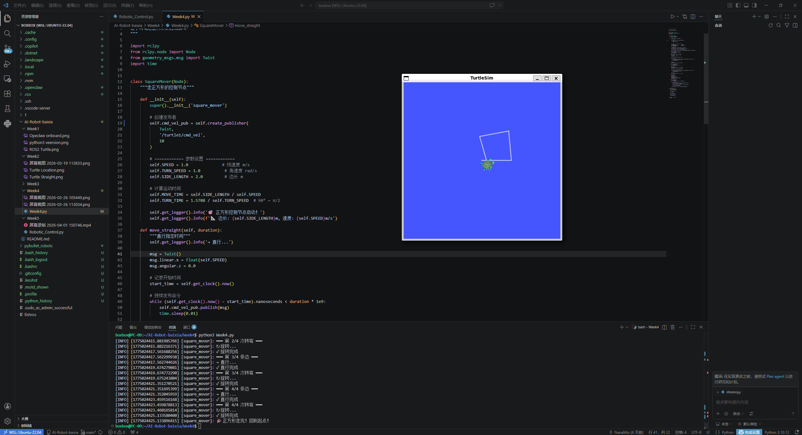
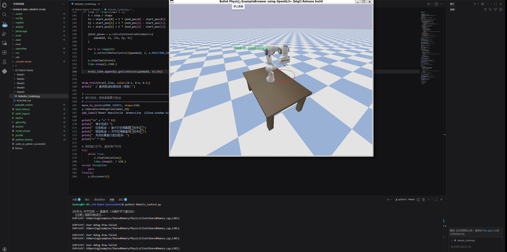

# Week 5：Linux 目录操作与机器人运动学

本周学习 Linux 文件目录操作，并结合机器人运动学练习 Python 编程。课程内容从命令行文件管理扩展到机器人控制脚本：一方面要能在终端中清楚地组织代码和素材，另一方面要理解机器人关节、坐标和运动轨迹之间的关系。

## 实验内容

- 练习 Linux 常用文件命令：`pwd`、`ls`、`cd`、`mkdir`、`cp`、`mv`、`rm`。
- 整理课程作业目录，区分 README、图片、代码和视频文件。
- 编写 Python 脚本控制 turtlesim 或模拟机器人运动。
- 初步理解机械臂或移动机器人的运动学概念。

## 文件说明

- `Week5.py`：本周 Python 练习脚本。
- `Robotic_Control.py`：机器人控制相关示例代码。
- `video5-1.mp4`：运行或演示视频。
- `img5-1.png`、`img5-2.png`：实验截图。

## 运行方式

```bash
python3 Week5.py
python3 Robotic_Control.py
```

如果脚本依赖 ROS2 或图形仿真，需要先启动对应环境：

```bash
source /opt/ros/humble/setup.bash
```

## 运行截图





## 演示视频

本周演示视频记录了截图对应的环境、命令或实验效果，便于在 GitHub Pages 中和截图一起检查作业完成情况。

[点击查看本周演示视频](video5-1.mp4)

## 课程内容摘要

本周把 Linux 目录操作与机器人运动学结合起来。目录操作部分训练的是工程项目组织能力，例如如何用 `mkdir`、`cp`、`mv`、`rm`、相对路径和绝对路径管理实验文件；运动学部分则继续关注机器人如何把速度指令转换成位置变化。相比 Week4 的基础坐标理解，本周更强调“把程序放在正确位置、用正确命令运行、输出可检查结果”。我在 README 中记录运行方式、代码文件和截图，是为了让作业目录本身成为一个可复现的小实验包。

## 学习总结

本周让我意识到目录结构和代码同样重要。机器人实验通常会产生脚本、截图、视频、模型文件和说明文档，如果没有清楚的文件组织，后续复现实验会很困难。运动学部分则让我开始理解机器人动作背后的数学关系：控制指令会改变位姿，多个关节或多个速度分量组合后才形成完整运动。


