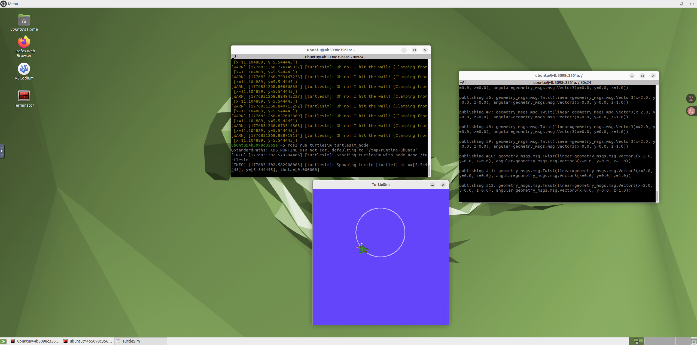

# Week 8：Docker 安装与 ROS2 桌面容器

本周学习 Docker 的基础概念，并使用 ROS2 桌面容器运行图形化机器人实验。Docker 可以把复杂的软件环境打包起来，减少不同电脑之间配置不一致的问题。对于 ROS2、PyBullet、OpenCV 这类依赖较多的机器人实验，容器环境非常实用。

## 实验内容

- 安装 Docker Desktop 或 Linux Docker 环境。
- 拉取并运行 ROS2 桌面 VNC 镜像。
- 通过浏览器访问 noVNC 桌面。
- 在容器中运行 ROS2 或 turtlesim 示例。
- 记录容器启动、桌面访问和实验运行截图。

## 常用命令

```bash
docker pull ghcr.io/tiryoh/ros2-desktop-vnc:humble
docker run -p 6080:80 --security-opt seccomp=unconfined --shm-size=512m ghcr.io/tiryoh/ros2-desktop-vnc:humble
docker ps
docker stop <container_id>
```

浏览器访问：

```text
http://localhost:6080
```

## 代码说明

`week8_docker_commands.py` 汇总了本周最常用的 Docker 命令和 noVNC 访问地址。运行方式：

```bash
python3 week8_docker_commands.py
```

## 运行截图





## 课程内容摘要

本周重点是 Docker 与 ROS2 桌面容器。Docker 的意义在于把依赖、系统版本和运行命令封装到容器中，减少“我这里能跑、别人那里不能跑”的问题。ROS2 图形界面对网络、显示和权限都有要求，因此用容器统一环境非常适合教学实验。README 中记录镜像、容器启动和常用命令，是为了把环境搭建从一次性操作变成可重复流程，也为后续 OpenCV、网页部署和项目演示打基础。

## 学习总结

Docker 让我理解了“环境也是项目的一部分”。以前运行程序时，很多问题来自 Python 版本、系统依赖或图形界面配置不一致；使用容器后，可以把课程需要的软件环境固定下来。后续 Week 10、Week 11 和 Week 14 的实验都可以继续利用这个思路，在同一个容器环境中运行机器人仿真和网页服务。


