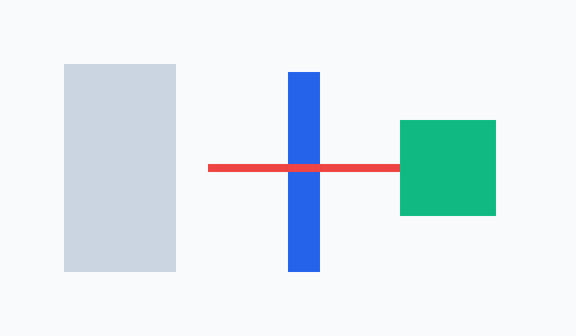

# Week 9：机器人与机器视觉数学基础

本周学习机器人视觉中常见的数学关系，包括像素坐标、视场角、相机焦距、目标尺寸和距离估计之间的联系。虽然这一周是网课形式，但它为后续 OpenCV、ArUco 标记识别、手机摄像头测距和机器人自主感知打下了基础。

## 学习目标

- 理解图像坐标系和机器人坐标系的差异。
- 了解相机视场角 FOV 与像素偏移量之间的关系。
- 掌握利用“真实宽度、焦距像素、图像中观测宽度”估计距离的基本公式。
- 为 Week 10 的 OpenCV 图像处理和 Week 12 的 ArUco 距离测量做准备。

## 数学关系

常用的单目视觉距离估计公式为：

```text
distance = real_width * focal_length_px / observed_width_px
```

当目标在图像中越大，说明它离相机越近；当目标在图像中越小，说明它离相机越远。实际使用时还需要考虑镜头畸变、目标姿态、标定误差和检测框稳定性。

像素到角度的简化关系为：

```text
angle = normalized_pixel_offset * horizontal_fov / 2
```

这个关系可以帮助机器人判断目标在视野左侧还是右侧，从而决定转向方向。

## 示意图



## 代码文件

本周补充 `week9_robot_math.py`，包含两个小函数：

- `pixel_to_angle()`：根据像素位置估计目标相对相机中心的角度。
- `estimate_distance()`：根据目标真实尺寸和图像观测宽度估计距离。

运行方式：

```bash
python3 week9_robot_math.py
```

## 课程内容摘要

本周通过网课形式补充机器人和机器视觉数学基础。移动机器人需要坐标变换、角度、向量和矩阵来描述位置与姿态；机器视觉需要像素坐标、相机成像、尺度关系和几何约束来理解图像中的目标。虽然本周代码量不大，但它补上了后续 ArUco 识别、距离测量和路径规划背后的数学解释。我在 README 中把公式关系、示意图和 Python 计算脚本放在一起，便于从概念过渡到实现。

## 学习总结

这一周让我意识到机器人视觉并不是只靠“看见图片”，还需要把图像中的像素信息转换成机器人可以使用的空间信息。后续如果要让机器人追踪目标、避障或自动导航，就必须知道目标大概在什么方向、距离多远，以及当前估计是否可靠。本周的数学公式虽然简单，但它们是后面 ArUco 测距和 OpenCV 实验的基础。


